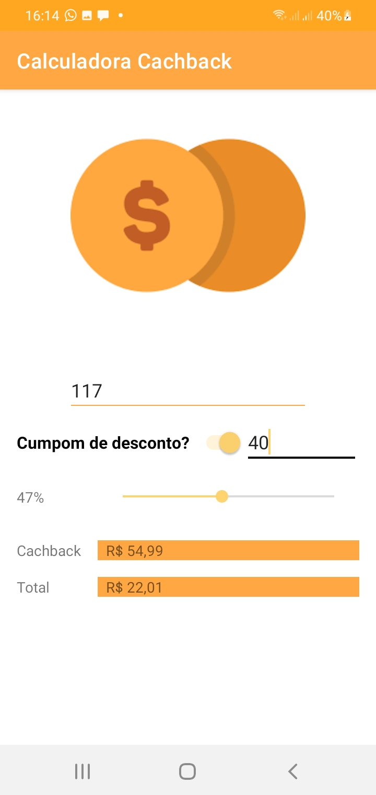

<h1  align="center">Calculadora CachBack</h1>

Um aplicativo que calcula o valor total de uma conta baseado nas informações dadas pelo usuario. 
Podendo aplicar um cupom de desconto e/ou uma porcentagem de Cachback, o usuario receberá o valor total que deverá pagar na sua compra.
  
<h3> Telas do aplicativo em um celular Galaxy A01</h3>

 

